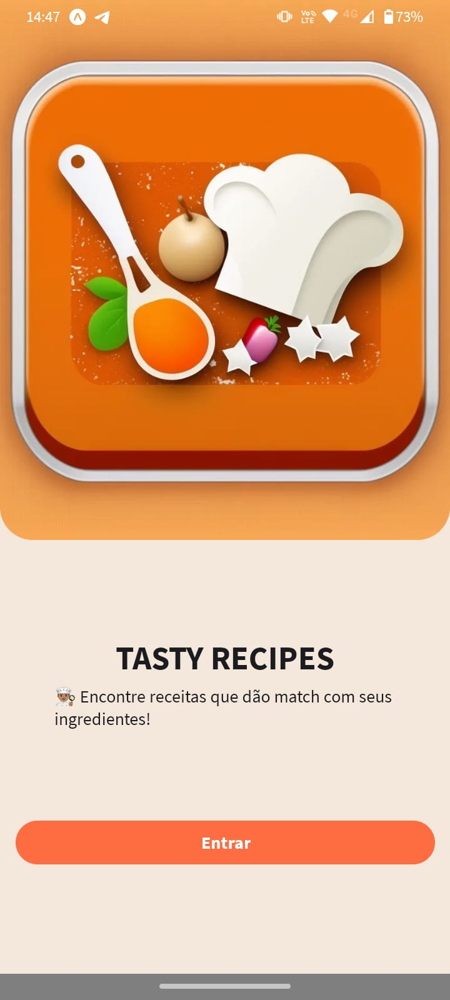

# APP Tasty Recipes - Challenge

## **Descrição**
Aplicação onde o usuário pode encontrar receitas possíveis de serem feitas a partir de ingredientes que existe em sua lista de ingredientes.

## **Tecnologias utilizadas**
  - React Native 
  - [three](https://reactnativepaper.com/)
  - Expo
  - Typescript
  - [React Navigation](https://reactnativepaper.com/)

## **SCREENSHOTS**

  
   
   
   
   

